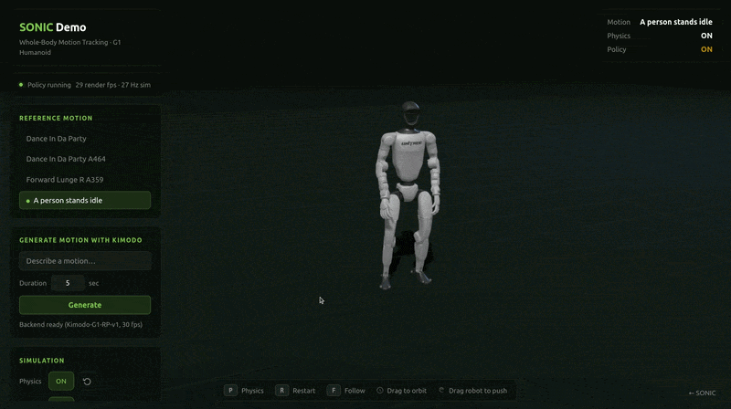

<p align="center">
  
  <a href="LICENSE"></a>
  <a href="https://research.nvidia.com/labs/sil/projects/kimodo/"></a>
  <a href="https://research.nvidia.com/labs/sil/projects/kimodo/docs/index.html"></a>
</p>

## Overview

Kimodo is a **ki**nematic **mo**tion **d**iffusi**o**n model trained on a large-scale (700 hours) commercially-friendly optical motion capture dataset. The model generates high-quality 3D human and robot motions, and is controlled through text prompts and an extensive set of constraints such as full-body pose keyframes, end-effector positions/rotations, 2D paths, and 2D waypoints. Full details of the model architecture and training are available in the [technical report](https://research.nvidia.com/labs/sil/projects/kimodo/assets/kimodo_tech_report.pdf).

This repository provides:
- **Inference**: code and CLI to generate motions on both human and robot skeletons
- **Interactive Demo**: easily author motions with a timeline interface of text prompts and kinematic controls
- **Annotations**: [additional text descriptions](https://huggingface.co/datasets/nvidia/SEED-Timeline-Annotations) for the [BONES-SEED](https://huggingface.co/datasets/bones-studio/seed) dataset, including fine-grained temporal descriptions
- **Benchmark**: [test cases](https://huggingface.co/datasets/nvidia/Kimodo-Motion-Gen-Benchmark) and evaluation code built on the [BONES-SEED](https://huggingface.co/datasets/bones-studio/seed) dataset to evaluate motion generation models based on text and constraint-following abilities

<div align="center">
  
</div>

## News

See the [full changelog](CHANGELOG.md) for a detailed list of all changes.

- **[2026-04-10]** _NEW_: Released the [Kimodo Motion Generation Benchmark](#kimodo-motion-generation-benchmark) alongside new v1.1 Kimodo-SOMA models
- **[2026-03-19]** **Breaking:** Model inputs/outputs now use the SOMA 77-joint skeleton (`somaskel77`).
- **[2026-03-16]** Initial open-source release of Kimodo with five model variants (SOMA, G1, SMPL-X), CLI, interactive demo, and timeline annotations for BONES-SEED.


## Kimodo Models

Several variations of Kimodo are available trained on various skeletons and datasets. All models support text-to-motion and kinematic controls.

> Note: models will be downloaded automatically when attempting to generate from the CLI or Interactive Demo, so there is no need to download them manually

| Model | Skeleton | Training Data | Release Date | Hugging Face | License |
|:-------|:-------------|:------:|:------:|:-------------:|:-------------:|
| **Kimodo-SOMA-RP-v1.1** | [SOMA](https://github.com/NVlabs/SOMA-X) | [Bones Rigplay 1](https://bones.studio/datasets#rp01) | April 10, 2026 | [Link](https://huggingface.co/nvidia/Kimodo-SOMA-RP-v1.1) | [NVIDIA Open Model](https://www.nvidia.com/en-us/agreements/enterprise-software/nvidia-open-model-license/) |
| **Kimodo-SOMA-SEED-v1.1** | [SOMA](https://github.com/NVlabs/SOMA-X) | [BONES-SEED](https://huggingface.co/datasets/bones-studio/seed) | April 10, 2026  | [Link](https://huggingface.co/nvidia/Kimodo-SOMA-SEED-v1.1) | [NVIDIA Open Model](https://www.nvidia.com/en-us/agreements/enterprise-software/nvidia-open-model-license/) |
| **Kimodo-SOMA-RP-v1** | [SOMA](https://github.com/NVlabs/SOMA-X) | [Bones Rigplay 1](https://bones.studio/datasets#rp01) | March 16, 2026 | [Link](https://huggingface.co/nvidia/Kimodo-SOMA-RP-v1) | [NVIDIA Open Model](https://www.nvidia.com/en-us/agreements/enterprise-software/nvidia-open-model-license/) |
| **Kimodo-G1-RP-v1** | [Unitree G1](https://github.com/unitreerobotics/unitree_mujoco/tree/main/unitree_robots/g1) | [Bones Rigplay 1](https://bones.studio/datasets#rp01) | March 16, 2026  | [Link](https://huggingface.co/nvidia/Kimodo-G1-RP-v1) | [NVIDIA Open Model](https://www.nvidia.com/en-us/agreements/enterprise-software/nvidia-open-model-license/) |
| **Kimodo-SOMA-SEED-v1** | [SOMA](https://github.com/NVlabs/SOMA-X) | [BONES-SEED](https://huggingface.co/datasets/bones-studio/seed) | March 16, 2026  | [Link](https://huggingface.co/nvidia/Kimodo-SOMA-SEED-v1) | [NVIDIA Open Model](https://www.nvidia.com/en-us/agreements/enterprise-software/nvidia-open-model-license/) |
| **Kimodo-G1-SEED-v1** | [Unitree G1](https://github.com/unitreerobotics/unitree_mujoco/tree/main/unitree_robots/g1) | [BONES-SEED](https://huggingface.co/datasets/bones-studio/seed) | March 16, 2026  | [Link](https://huggingface.co/nvidia/Kimodo-G1-SEED-v1) | [NVIDIA Open Model](https://www.nvidia.com/en-us/agreements/enterprise-software/nvidia-open-model-license/) |
| **Kimodo-SMPLX-RP-v1** | [SMPL-X](https://github.com/vchoutas/smplx) | [Bones Rigplay 1](https://bones.studio/datasets#rp01) | March 16, 2026  | [Link](https://huggingface.co/nvidia/Kimodo-SMPLX-RP-v1) | [NVIDIA R&D Model](https://www.nvidia.com/en-us/agreements/enterprise-software/nvidia-internal-scientific-research-and-development-model-license/) |

By default, we recommend using the models trained on the full Bones Rigplay 1 dataset (700 hours of mocap) for your motion generation needs.
The models trained on BONES-SEED use 288 hours of [publicly available mocap data](https://huggingface.co/datasets/bones-studio/seed) so are less capable, but are useful for comparing to other models trained on BONES-SEED. To easily compare motion generation models to Kimodo, check out our [Motion Generation Benchmark](#kimodo-motion-generation-benchmark).

### Changes in v1.1
The latest v1.1 Kimodo-SOMA models were released primarily for compatibility with our new [Motion Generation Benchmark](#kimodo-motion-generation-benchmark), but also contain minor quality improvements over v1. For details on these improvements, please see the Hugging Face pages for [Kimodo-SOMA-RP-v1.1](https://huggingface.co/nvidia/Kimodo-SOMA-RP-v1.1#changes-in-v11) and [Kimodo-SOMA-SEED-v1.1](https://huggingface.co/nvidia/Kimodo-SOMA-SEED-v1.1#changes-in-v11).

## 本地快速部署（本仓库实测流程）

> 本节为本机实测流程，无需申请 `meta-llama/Meta-Llama-3-8B-Instruct` 的 gated 访问权限，使用社区非 gated 镜像 `NousResearch/Meta-Llama-3-8B-Instruct` 作为 LLM2Vec 基模型替换。权重与官方 Llama-3-8B-Instruct 一致，与 Kimodo 训练分布兼容。
>
> 测试环境：Ubuntu / Linux 6.8、RTX 3090 (24GB)、NVIDIA 驱动 565.77、CUDA 12.7。

### 1. 安装 Miniconda（若已有 conda 可跳过）

```bash
wget https://repo.anaconda.com/miniconda/Miniconda3-latest-Linux-x86_64.sh -O /tmp/miniconda.sh
bash /tmp/miniconda.sh -b -p $HOME/miniconda3
$HOME/miniconda3/bin/conda init bash
# 可选：不自动进入 base 环境
$HOME/miniconda3/bin/conda config --set auto_activate_base false
# 接受 TOS（conda 26+ 新环境首次需要）
$HOME/miniconda3/bin/conda tos accept --override-channels --channel https://repo.anaconda.com/pkgs/main
$HOME/miniconda3/bin/conda tos accept --override-channels --channel https://repo.anaconda.com/pkgs/r
source ~/.bashrc
```

### 2. 创建 kimodo 环境并装 PyTorch

```bash
conda create -n kimodo python=3.10 -y
conda activate kimodo

# 避免系统 ROS 注入 PYTHONPATH 污染 conda 环境
unset PYTHONPATH
export PYTHONNOUSERSITE=1

# 安装与 CUDA 驱动兼容的 GPU 版 PyTorch（此处 CUDA 12.4 对 3090/4090 均可）
pip install torch torchvision --index-url https://download.pytorch.org/whl/cu124
```

### 3. 安装 Kimodo（含 demo/SOMA 扩展）

在仓库根目录（本 README 所在路径）执行：

```bash
pip install -e ".[all]"
```

### 4. 下载本地文本编码器（绕开 gated Llama-3）

Kimodo 的 LLM2Vec 默认会拉取 gated `meta-llama/Meta-Llama-3-8B-Instruct`。源码 `kimodo/model/llm2vec/llm2vec_wrapper.py` 已支持 `TEXT_ENCODERS_DIR` 环境变量从本地加载，且 `llm2vec.py` 会用本地目录的 `config.json._name_or_path` 覆盖名称，因此可以用非 gated 镜像 + LLM2Vec 配置组合成完全可用的本地编码器。

```bash
mkdir -p $HOME/kimodo_text_encoders/McGill-NLP/LLM2Vec-Meta-Llama-3-8B-Instruct-mntp
mkdir -p $HOME/kimodo_text_encoders/McGill-NLP/LLM2Vec-Meta-Llama-3-8B-Instruct-mntp-supervised

# 4.1 基模型权重：用非 gated 镜像（约 15GB）
hf download NousResearch/Meta-Llama-3-8B-Instruct \
  --local-dir $HOME/kimodo_text_encoders/McGill-NLP/LLM2Vec-Meta-Llama-3-8B-Instruct-mntp

# 4.2 覆盖 LLM2Vec 的 config.json / tokenizer（关键：让 chat template 匹配官方 Llama-3-Instruct）
hf download McGill-NLP/LLM2Vec-Meta-Llama-3-8B-Instruct-mntp \
  --local-dir $HOME/kimodo_text_encoders/McGill-NLP/LLM2Vec-Meta-Llama-3-8B-Instruct-mntp \
  --include "*.json" "tokenizer*" "special_tokens_map.json"

# 4.3 LLM2Vec 的 supervised PEFT adapter（非 gated）
hf download McGill-NLP/LLM2Vec-Meta-Llama-3-8B-Instruct-mntp-supervised \
  --local-dir $HOME/kimodo_text_encoders/McGill-NLP/LLM2Vec-Meta-Llama-3-8B-Instruct-mntp-supervised
```

最终目录结构：

```text
~/kimodo_text_encoders/
└── McGill-NLP/
    ├── LLM2Vec-Meta-Llama-3-8B-Instruct-mntp/                 # 基模型 + LLM2Vec 配置
    └── LLM2Vec-Meta-Llama-3-8B-Instruct-mntp-supervised/      # PEFT adapter
```

### 5. 写入 shell 快捷入口（可选但推荐）

把以下两行追加到 `~/.bashrc`：

```bash
export TEXT_ENCODERS_DIR="$HOME/kimodo_text_encoders"
alias kimodo-env='unset PYTHONPATH && export TEXT_ENCODERS_DIR="$HOME/kimodo_text_encoders" && conda activate kimodo'
```

使其生效：

```bash
source ~/.bashrc
```

### 6. 启动交互式 Demo

```bash
kimodo-env          # 激活环境 + 清 PYTHONPATH + 设 TEXT_ENCODERS_DIR
kimodo_demo         # 启动 Web 界面
```

浏览器打开 <http://localhost:7860> 使用。远程服务器需端口转发：

```bash
ssh -L 7860:localhost:7860 <user>@<host>
```

### 7. 命令行生成（无需 Web 界面）

```bash
kimodo-env
kimodo_gen "A person walks and falls to the ground." --duration 5 --num_samples 2
```

### 常见问题

- **OOM（CUDA out of memory）**：Kimodo 加载 Llama-3-8B bf16 需要约 17GB 显存。检查 `nvidia-smi` 是否有其他进程占用，先 `kill <pid>` 释放：
  ```bash
  nvidia-smi --query-compute-apps=pid,process_name,used_memory --format=csv
  ```
- **401 gated repo**：说明 `TEXT_ENCODERS_DIR` 没生效或本地目录结构不对。确认 `echo $TEXT_ENCODERS_DIR` 非空，且存在上面第 4 步中的两个子目录。
- **transformers 报 `OSError: You are trying to access a gated repo`**：第 4.2 步的 config/tokenizer 文件缺失导致 LLM2Vec 回退去网上拉 gated 仓库；补下即可。
- **PYTHONPATH 干扰**：系统若装了 ROS 等，会在 shell 里写入 `PYTHONPATH`，conda 环境会被污染导致导入错位。`kimodo-env` 别名已自动 `unset PYTHONPATH`。

---

## Getting Started

Please see the full documentation for detailed installation instructions, how to use the CLI and Interactive Demo, and other practical tips for generating motions with Kimodo:

**[Full Documentation](https://research.nvidia.com/labs/sil/projects/kimodo/docs)**
- [Quick Start Guide](https://research.nvidia.com/labs/sil/projects/kimodo/docs/getting_started/quick_start.html)
- [Installation Instructions](https://research.nvidia.com/labs/sil/projects/kimodo/docs/getting_started/installation.html)
- [Interactive Motion Authoring Demo](https://research.nvidia.com/labs/sil/projects/kimodo/docs/interactive_demo/index.html)
- [Command-Line Interface](https://research.nvidia.com/labs/sil/projects/kimodo/docs/user_guide/cli.html)
- [Benchmark Instructions](https://research.nvidia.com/labs/sil/projects/kimodo/docs/benchmark/introduction.html)
- [API Reference](https://research.nvidia.com/labs/sil/projects/kimodo/docs/api_reference/index.html)

**Before getting started** with motion generation, please review the [best practices](https://research.nvidia.com/labs/sil/projects/kimodo/docs/key_concepts/limitations.html) and be aware of [model limitations](https://research.nvidia.com/labs/sil/projects/kimodo/docs/key_concepts/limitations.html#limitations).


Some notes on installation environment:
- Kimodo requires ~17GB of VRAM to generate locally, primarily due to the text embedding model
- The model has been most extensively tested on GeForce RTX 3090, GeForce RTX 4090, and NVIDIA A100 GPUs, but should work on other recent cards with sufficient VRAM
- This repo was developed on Linux, though Windows should work especially if using Docker

## Interactive Motion Authoring Demo

<div align="center">
  
</div>

</br>

**[Demo Documentation and Tutorial](https://research.nvidia.com/labs/sil/projects/kimodo/docs/interactive_demo/index.html)**

The web-based interactive demo provides an intuitive interface for generating motions with any of the Kimodo model variations. After installation, the demo can be launched with the `kimodo_demo` command. It runs locally on http://127.0.0.1:7860. Open this URL in your browser to access the interface (or use port forwarding if set up on a server).

### Demo Features
- **Multiple Characters**: Supports generating with the SOMA, G1, and SMPL-X versions of Kimodo
- **Text Prompts**: Enter one or more natural language descriptions of desired motions on the timeline
- **Timeline Editor**: Add and edit keyframes and constrained intervals on multiple constraint tracks
- **Constraint Types**:
  - Full-Body: Complete joint position constraints at specific frames
  - 2D Root: Define waypoints or full paths to follow on the ground plane
  - End-Effectors: Control hands and feet positions/rotations
- **Constraint Editing**: Editing mode allows for re-posing of constraints or adjusting waypoints
- **3D Visualization**: Real-time rendering of generated motions with skeleton and skinned mesh options
- **Playback Controls**: Preview generated motions with adjustable playback speed
- **Multiple Samples**: Generate and compare multiple motion variations
- **Examples**: Load pre-existing examples to better understand Kimodo's capabilities
- **Export**: Save constraints and generated motions for later use

## Command-Line Interface

**[CLI Documentation and Examples](https://research.nvidia.com/labs/sil/projects/kimodo/docs/user_guide/cli.html)**

Motions can also be generated directly from the command line with the `kimodo_gen` command or by running `python -m kimodo.scripts.generate` directly.

**Key Arguments:**
- `prompt`: A single text description or sequence of texts for the desired motion (required)
- `--model`: Which Kimodo model to use for generation
- `--duration`: Motion duration in seconds
- `--num_samples`: Number of motion variations to generate
- `--constraints`: Constraint file to control the generated motion (e.g., saved from the web demo)
- `--diffusion_steps`: Number of denoising steps
- `--cfg_type` / `--cfg_weight`: Classifier-free guidance (`nocfg`, `regular` with one weight, or `separated` with two weights for text vs. constraints); see the [CLI docs](https://research.nvidia.com/labs/sil/projects/kimodo/docs/user_guide/cli.html#classifier-free-guidance-cfg)
- `--no-postprocess`: Flag to disable foot skate and constraint cleanup post-processing
- `--seed`: Random seed for reproducible results

The script supports different output formats depending on which skeleton is used. By default, a custom NPZ format is saved that is compatible with the web demo.
For Kimodo-G1 models, the motion can be saved in the standard MuJoCo qpos CSV format.
For Kimodo-SMPLX, motion can be saved in the standard AMASS npz format for compability with existing pipelines.

### Default NPZ Output Format
Generated motions are saved as NPZ files containing:
- `posed_joints`: Global joint positions `[T, J, 3]`
- `global_rot_mats`: Global joint rotation matrices `[T, J, 3, 3]`
- `local_rot_mats`: Local (parent-relative) joint rotation matrices `[T, J, 3, 3]`
- `foot_contacts`: Foot contact labels [left heel, left toe, right heel, right toes] `[T, 4]`
- `smooth_root_pos`: Smoothed root representations outputted from the model `[T, 3]`
- `root_positions`: The (non-smoothed) trajectory of the actual root joint (e.g., pelvis) `[T, 3]`
- `global_root_heading`: The heading direction output from the model `[T, 2]`

`T` the number of frames and `J` the number of joints.

## Low-Level Python API

**[Model API Documentation](https://research.nvidia.com/labs/sil/projects/kimodo/docs/api_reference/model.html#kimodo.model.kimodo_model.Kimodo.__call__)**

For maximum flexibility, the low-level model inference API can be called directly, rather than going through our high-level CLI.
This allows for advanced model configuration including classifier-free guidance weights and parameters related to transitions in multi-prompt sequences.

## Downstream Robotics Applications of Kimodo

### Visualizing G1 Motions with MuJoCo

<div align="center">
  
</div>

After generating motions on the G1 robot skeleton and saving to the MuJoCo qpos CSV file format, they can be easily used and visualized within MuJoCo.
A minimal visualization script is available with:
```
python -m kimodo.scripts.mujoco_load
```
Make sure to edit the script to correctly point to your CSV file and install Mujoco before running this.

### Tracking Generated Motions with ProtoMotions

<div align="center">
  
</div>

[ProtoMotions](https://github.com/NVlabs/ProtoMotions) is a GPU-accelerated simulation and learning framework for training physically simulated digital humans and humanoid robots. The Kimodo NPZ and CSV output formats are both compatible with ProtoMotions making it easy to train physics-based policies with generated motions from Kimodo. ProtoMotions supports outputs on both the SOMA skeleton and Unitree G1

After generating motions with Kimodo, head over to the [ProtoMotions docs](https://github.com/NVlabs/ProtoMotions?tab=readme-ov-file#-motion-authoring-with-kimodo) to see how to import them.

### Retargeting Motions to Other Robots with GMR

<div align="center">
  
</div>

Motions generated by Kimodo-SMPLX can be retargeted to other robots using [General Motion Retargeting (GMR)](https://github.com/YanjieZe/GMR).
GMR supports the AMASS NPZ format out of the box, so simply generate motions with Kimodo and use `--output` to save; the AMASS NPZ is written to `stem_amass.npz` (single sample) or in the output folder (multiple samples). Then, use the [SMPL-X to Robot script](https://github.com/YanjieZe/GMR?tab=readme-ov-file#retargeting-from-smpl-x-amass-omomo-to-robot) in GMR to retarget to any supported robot. For example:
```
# run within GMR codebase
python scripts/smplx_to_robot.py --smplx_file /path/to/saved/amass_format.npz --robot booster_t1
```

### Combining Kimodo with GEAR-SONIC

<div align="center">
  
</div>

As a proof of concept, we have also incorporated Kimodo into the [interactive GEAR-SONIC demo](https://nvlabs.github.io/GEAR-SONIC/demo.html). In the demo, Kimodo can be used to generate a kinematic motion on the G1 robot skeleton, then GEAR-SONIC tracks the motion in simulation.

## Kimodo Motion Generation Benchmark

[**[Benchmark Documentation](https://research.nvidia.com/labs/sil/projects/kimodo/docs/benchmark/introduction.html)**]
[**[Test Suite on Hugging Face](https://huggingface.co/datasets/nvidia/Kimodo-Motion-Gen-Benchmark)**]

Alongside the Kimodo models, we provide a benchmark designed to standardize evaluation for motion generation models with a comprehensive set of test cases. This includes:

* **Evaluation Data**: A suite of test cases [available on Hugging Face](https://huggingface.co/datasets/nvidia/Kimodo-Motion-Gen-Benchmark) is used in concert with the [BONES-SEED](https://huggingface.co/datasets/bones-studio/seed) dataset to construct the full benchmark. 
* **Diverse Test Cases**: Test cases cover a wide range of text-conditioned and constraint-conditioned motion generation.
* **Evaluation Pipeline**: Code for the full evaluation pipeline including benchmark construction, motion generation, and evaluation.
* **Metrics**: Several metrics to evaluate generated motions that cover motion quality, constraint following, and text alignment. Our [TMR-SOMA-RP-v1](https://huggingface.co/nvidia/TMR-SOMA-RP-v1) model trained on all 700 hours of the Bones Rigplay dataset is a powerful embedding model to compute common metrics like R-precision and FID.

To facilitate future research, we [report benchmark results](https://research.nvidia.com/labs/sil/projects/kimodo/docs/benchmark/results.html) for Kimodo-SOMA-v1.1 models, which are reproducible and easily comparable to other methods trained on the BONES-SEED data. 

## Timeline Annotations for BONES-SEED

As detailed in the [tech report](https://research.nvidia.com/labs/sil/projects/kimodo/assets/kimodo_tech_report.pdf), Kimodo is trained using fine-grained temporal text annotations of mocap clips.
While the full [Rigplay 1](https://bones.studio/datasets#rp01) dataset is proprietary, we have released the temporal segmentations for the public [BONES-SEED](https://huggingface.co/datasets/bones-studio/seed) subset.
These annotations are already included in the BONES-SEED dataset, but the standalone labels and additional information about them is [available on HuggingFace](https://huggingface.co/datasets/nvidia/SEED-Timeline-Annotations).


## Related Humanoid Work at NVIDIA
Kimodo is part of a larger effort to enable humanoid motion data for robotics, physical AI, and other applications.

Check out these related works:
* [SOMA Body Model](https://github.com/NVlabs/SOMA-X) - a unified parameteric human body model
* [BONES-SEED Dataset](https://huggingface.co/datasets/bones-studio/seed) - a large scale human(oid) motion capture dataset in SOMA and G1 format
* [ProtoMotions](https://github.com/NVlabs/ProtoMotions) - simulation and learning framework for training physically simulated human(oid)s
* [SOMA Retargeter](https://github.com/NVIDIA/soma-retargeter) - SOMA to G1 retargeting tool
* [GEM](https://github.com/NVlabs/GEM-X) - human motion reconstruction from video
* [GEAR SONIC](https://github.com/NVlabs/GR00T-WholeBodyControl) - humanoid behavior foundation model for physical robots

## Citation

If you use this code in your research, please cite:

```bibtex
@article{Kimodo2026,
  title={Kimodo: Scaling Controllable Human Motion Generation},
  author={Rempe, Davis and Petrovich, Mathis and Yuan, Ye and Zhang, Haotian and Peng, Xue Bin and Jiang, Yifeng and Wang, Tingwu and Iqbal, Umar and Minor, David and de Ruyter, Michael and Li, Jiefeng and Tessler, Chen and Lim, Edy and Jeong, Eugene and Wu, Sam and Hassani, Ehsan and Huang, Michael and Yu, Jin-Bey and Chung, Chaeyeon and Song, Lina and Dionne, Olivier and Kautz, Jan and Yuen, Simon and Fidler, Sanja},
  journal={arXiv:2603.15546},
  year={2026}
}
```

## License

This codebase is licensed under [Apache-2.0](LICENSE). Note that model checkpoints and data are licensed separately as indicated on the HuggingFace download pages.

This project will download and install additional third-party open source software projects. Review the license terms of these open source projects before use.

## Acknowledgments

This project builds upon excellent open-source projects:
- [Viser](https://github.com/nerfstudio-project/viser) for 3D motion authoring demo
- [LLM2Vec](https://github.com/McGill-NLP/llm2vec) for text encoding

## Contact

For questions or issues, please open an issue on this repository or reach out directly to the authors.

---
